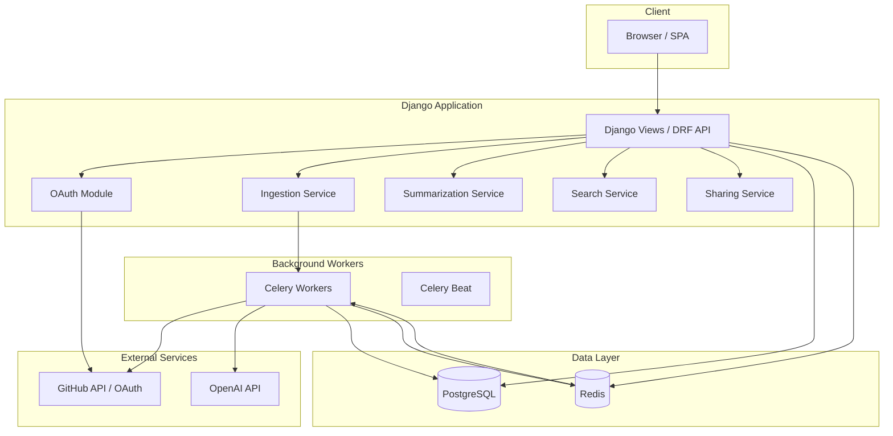
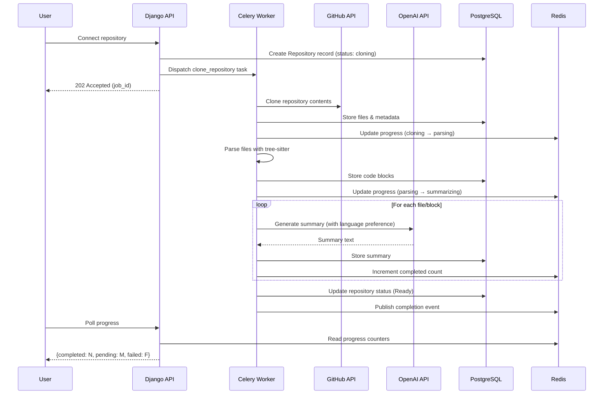
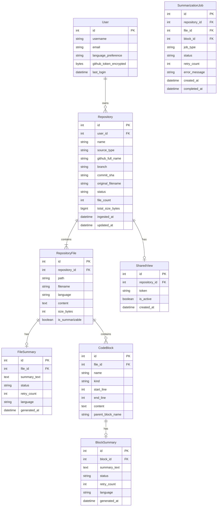

# Design Document: AI Codebase Explorer

## Overview

The AI Codebase Explorer is the MVP wedge feature of the Developer Super-App. It enables developers to connect a GitHub repository (via OAuth) or upload a ZIP archive, after which the system automatically generates plain-language AI summaries for every file and code block. Users can browse the repository structure in a file tree, search summaries using natural language, configure their preferred summary language, and share explored repositories publicly via unique URLs.

The system is built on Django with PostgreSQL, uses Celery + Redis for asynchronous job processing, tree-sitter for multi-language code parsing, and the OpenAI API (GPT-4o-mini) for summary generation. PostgreSQL full-text search powers the summary search feature.

### Key Design Decisions

| Decision | Choice | Rationale |
|----------|--------|-----------|
| Task queue | Celery + Redis | Industry standard for Django async work; Redis provides fast broker with pub/sub for progress updates |
| Code parsing | tree-sitter (via `tree-sitter-language-pack`) | Multi-language AST parsing; extracts functions/classes/methods reliably across 30+ languages |
| AI provider | OpenAI GPT-4o-mini | Cost-effective for high-volume summarization; sufficient quality for code explanations |
| Search | PostgreSQL full-text search with GIN indexes | No additional infrastructure; real-time indexing on commit; sufficient for per-repository scoped search |
| OAuth | `social-auth-app-django` | Mature, well-maintained Django OAuth library with GitHub backend |
| Token encryption | Django Fernet fields (symmetric encryption at rest) | Simple, auditable encryption for stored GitHub tokens |
| File storage | Database (PostgreSQL `TextField`) | Simplifies queries joining file content with summaries; repos capped at 500 MB |
| Progress updates | Celery task state + polling API (WebSocket upgrade path) | Simple initial implementation; polling every 5s is acceptable for MVP |

---

## Architecture

### High-Level Architecture



### Request Flow: Repository Ingestion & Summarization



---

## Components and Interfaces

### 1. Authentication Module (`explorer.auth`)

**Responsibility:** GitHub OAuth flow, session management, token storage.

```python
# Interfaces
class GitHubOAuthService:
    def initiate_oauth(request) -> HttpResponseRedirect
    def handle_callback(request, code: str) -> User
    def revoke_token(user: User) -> None

class TokenEncryptionService:
    def encrypt(token: str) -> bytes
    def decrypt(encrypted: bytes) -> str
```

### 2. Ingestion Module (`explorer.ingestion`)

**Responsibility:** Repository cloning (GitHub) and ZIP extraction, file storage, validation.

```python
# Interfaces
class IngestionService:
    def ingest_from_github(user: User, repo_full_name: str) -> Repository
    def ingest_from_zip(user: User, zip_file: UploadedFile) -> Repository
    def validate_repository_size(size_bytes: int) -> bool
    def validate_zip(file: UploadedFile) -> ValidationResult

# Celery Tasks
@shared_task
def clone_repository_task(repository_id: int) -> None

@shared_task
def extract_zip_task(repository_id: int, file_path: str) -> None
```

### 3. Code Parsing Module (`explorer.parsing`)

**Responsibility:** Extract code blocks (functions, classes, methods) from source files using tree-sitter.

```python
# Interfaces
class CodeParser:
    def parse_file(content: str, language: str) -> list[CodeBlock]
    def detect_language(filename: str) -> str | None
    def is_summarizable_file(filename: str) -> bool

@dataclass
class CodeBlock:
    name: str
    kind: str  # "function", "class", "method"
    start_line: int
    end_line: int
    content: str
    parent_block: str | None  # For methods within classes
```

### 4. Summarization Module (`explorer.summarization`)

**Responsibility:** AI summary generation, retry logic, language preference handling.

```python
# Interfaces
class SummarizationService:
    def summarize_file(file: RepositoryFile, language: str) -> FileSummary
    def summarize_block(block: CodeBlock, file_context: str, language: str) -> BlockSummary
    def retry_failed(repository_id: int) -> int  # Returns count of retried jobs

# Celery Tasks
@shared_task(bind=True, max_retries=3)
def summarize_file_task(self, file_id: int, language: str) -> None

@shared_task(bind=True, max_retries=3)
def summarize_block_task(self, block_id: int, language: str) -> None
```

### 5. Search Module (`explorer.search`)

**Responsibility:** Full-text search across summaries within a repository.

```python
# Interfaces
class SummarySearchService:
    def search(repository_id: int, query: str, limit: int = 50) -> list[SearchResult]

@dataclass
class SearchResult:
    file_path: str
    block_name: str | None
    summary_excerpt: str  # Up to 200 chars with match highlighted
    similarity_rank: float
    result_type: str  # "file" or "block"
```

### 6. Sharing Module (`explorer.sharing`)

**Responsibility:** Public URL generation, token management, shared view access control.

```python
# Interfaces
class SharingService:
    def enable_sharing(repository: Repository) -> SharedView
    def disable_sharing(repository: Repository) -> None
    def regenerate_url(repository: Repository) -> SharedView
    def get_shared_repository(token: str) -> Repository | None
```

### 7. Progress Module (`explorer.progress`)

**Responsibility:** Track and report summarization job progress.

```python
# Interfaces
class ProgressService:
    def get_progress(repository_id: int) -> ProgressReport
    def update_job_state(job_id: int, state: str) -> None

@dataclass
class ProgressReport:
    total_jobs: int
    completed: int
    pending: int
    failed: int
    status: str  # "cloning", "parsing", "summarizing", "ready", "partially_summarized", "failed"
```

---

## Data Models

### Entity Relationship Diagram



### Model Details

#### User (extends Django AbstractUser)

| Field | Type | Constraints |
|-------|------|-------------|
| language_preference | CharField(10) | Default: "en", choices from supported languages |
| github_token_encrypted | BinaryField | Nullable, encrypted at rest |

#### Repository

| Field | Type | Constraints |
|-------|------|-------------|
| user | ForeignKey(User) | CASCADE |
| name | CharField(255) | |
| source_type | CharField(10) | Choices: "github", "zip" |
| github_full_name | CharField(255) | Nullable (only for GitHub repos) |
| branch | CharField(100) | Nullable |
| commit_sha | CharField(40) | Nullable |
| original_filename | CharField(255) | Nullable (only for ZIP uploads) |
| status | CharField(30) | Choices: "cloning", "extracting", "parsing", "summarizing", "ready", "partially_summarized", "failed" |
| file_count | IntegerField | Default: 0 |
| total_size_bytes | BigIntegerField | Default: 0 |
| ingested_at | DateTimeField | auto_now_add |
| updated_at | DateTimeField | auto_now |

#### RepositoryFile

| Field | Type | Constraints |
|-------|------|-------------|
| repository | ForeignKey(Repository) | CASCADE |
| path | CharField(1000) | Full relative path from repo root |
| filename | CharField(255) | |
| language | CharField(50) | Detected language or "unknown" |
| content | TextField | |
| size_bytes | IntegerField | |
| is_summarizable | BooleanField | Default: True |

**Indexes:** `(repository, path)` unique together

#### FileSummary

| Field | Type | Constraints |
|-------|------|-------------|
| file | OneToOneField(RepositoryFile) | CASCADE |
| summary_text | TextField | 50–500 words |
| status | CharField(20) | Choices: "pending", "completed", "failed", "permanently_failed" |
| retry_count | IntegerField | Default: 0, max: 3 |
| language | CharField(10) | Language code |
| generated_at | DateTimeField | Nullable |

**Indexes:** GIN index on `summary_text` (tsvector) for full-text search

#### CodeBlock

| Field | Type | Constraints |
|-------|------|-------------|
| file | ForeignKey(RepositoryFile) | CASCADE |
| name | CharField(255) | |
| kind | CharField(20) | Choices: "function", "class", "method", "module_construct" |
| start_line | IntegerField | |
| end_line | IntegerField | |
| content | TextField | |
| parent_block_name | CharField(255) | Nullable (for methods within classes) |

#### BlockSummary

| Field | Type | Constraints |
|-------|------|-------------|
| block | OneToOneField(CodeBlock) | CASCADE |
| summary_text | TextField | Max 500 characters |
| status | CharField(20) | Choices: "pending", "completed", "failed", "permanently_failed" |
| retry_count | IntegerField | Default: 0, max: 3 |
| language | CharField(10) | Language code |
| generated_at | DateTimeField | Nullable |

**Indexes:** GIN index on `summary_text` (tsvector) for full-text search

#### SharedView

| Field | Type | Constraints |
|-------|------|-------------|
| repository | OneToOneField(Repository) | CASCADE |
| token | CharField(32) | Unique, URL-safe, min 22 chars |
| is_active | BooleanField | Default: True |
| created_at | DateTimeField | auto_now_add |

**Indexes:** Unique index on `token`

#### SummarizationJob

| Field | Type | Constraints |
|-------|------|-------------|
| repository | ForeignKey(Repository) | CASCADE |
| file | ForeignKey(RepositoryFile) | Nullable, CASCADE |
| block | ForeignKey(CodeBlock) | Nullable, CASCADE |
| job_type | CharField(10) | Choices: "file", "block" |
| status | CharField(20) | Choices: "pending", "in_progress", "completed", "failed", "permanently_failed" |
| retry_count | IntegerField | Default: 0, max: 3 |
| error_message | TextField | Nullable |
| created_at | DateTimeField | auto_now_add |
| completed_at | DateTimeField | Nullable |

**Indexes:** `(repository, status)` composite index for progress queries

---

## Correctness Properties

*A property is a characteristic or behavior that should hold true across all valid executions of a system — essentially, a formal statement about what the system should do. Properties serve as the bridge between human-readable specifications and machine-verifiable correctness guarantees.*

### Property 1: Token Encryption Round-Trip

*For any* valid GitHub access token string, encrypting the token with `TokenEncryptionService.encrypt()` and then decrypting the result with `TokenEncryptionService.decrypt()` SHALL produce a string identical to the original token.

**Validates: Requirements 1.4**

### Property 2: Repository Metadata Preservation

*For any* valid repository metadata (name, source_type, branch, commit_sha, original_filename, file_count), storing the metadata via the Ingestion Service and then retrieving it SHALL return all fields unchanged.

**Validates: Requirements 2.2, 3.6**

### Property 3: Ingestion Size and Count Validation

*For any* combination of compressed size, uncompressed size, and file count, the ingestion validator SHALL accept the input if and only if compressed size ≤ 200 MB AND uncompressed size ≤ 500 MB AND file count ≤ 10,000.

**Validates: Requirements 2.4, 3.3, 3.4**

### Property 4: ZIP Format Validation

*For any* byte sequence, the ZIP validator SHALL return valid=True if and only if the byte sequence is a structurally valid ZIP archive (starts with the ZIP magic bytes and contains a valid central directory).

**Validates: Requirements 3.2**

### Property 5: File Summarizability Classification

*For any* filename string, `is_summarizable_file()` SHALL return True if and only if the file extension belongs to the set of recognized programming/markup languages AND the filename does not match auto-generated file patterns (lock files, minified bundles, binary extensions).

**Validates: Requirements 4.1**

### Property 6: Summary Length Constraints

*For any* generated summary text, the file summary validator SHALL accept the text if and only if its word count is between 50 and 500 (inclusive), AND for block summaries, the validator SHALL accept the text if and only if its character count is at most 500.

**Validates: Requirements 4.3, 5.5**

### Property 7: Retry Logic Invariants

*For any* summarization job and any sequence of success/failure outcomes, the job's retry_count SHALL never exceed 3, a job that has failed 3 times SHALL be marked "permanently_failed" and excluded from further retries, and a retry operation SHALL never re-enqueue jobs whose status is "completed".

**Validates: Requirements 4.4, 5.6, 10.5, 10.6**

### Property 8: Repository Status Derivation

*For any* repository with a set of summarization jobs, the derived repository status SHALL be: "ready" if all jobs are completed, "failed" if all jobs are failed or permanently_failed, "partially_summarized" if at least one job is completed and at least one is failed/permanently_failed with none pending, and "summarizing" if any jobs are still pending or in_progress. Additionally, the sum of completed + pending + failed counts SHALL always equal the total job count.

**Validates: Requirements 4.6, 10.1, 10.2, 10.3, 10.4**

### Property 9: Code Block Parsing Validity

*For any* valid source code string in a supported language, the code parser SHALL return a list of code blocks where each block has a non-empty name, a valid kind (function/class/method/module_construct), start_line < end_line, start_line ≥ 1, and the block's content is a substring of the original source.

**Validates: Requirements 5.1**

### Property 10: Directory Sort Order

*For any* list of file and directory entries within a directory, the File_Tree_Browser sort function SHALL produce an ordering where all directories appear before all files, directories are sorted alphabetically (case-insensitive) among themselves, and files are sorted alphabetically (case-insensitive) among themselves.

**Validates: Requirements 6.2**

### Property 11: Search Result Ordering, Limit, and Isolation

*For any* search query executed against a repository, the returned results SHALL contain at most 50 items, each result SHALL belong to the queried repository (no cross-repository leakage), and results SHALL be ordered by decreasing similarity rank (result[i].rank ≥ result[i+1].rank for all i).

**Validates: Requirements 7.1, 7.6**

### Property 12: Search Query Validation

*For any* string, the query validator SHALL accept the string if and only if its length is between 3 and 300 characters (inclusive).

**Validates: Requirements 7.2**

### Property 13: Share Token Format and Uniqueness

*For any* generated share token, the token SHALL be at least 22 characters long, contain only URL-safe characters (alphanumeric, hyphen, underscore), and for any two tokens generated by the system, they SHALL be distinct.

**Validates: Requirements 9.1**

---

## Error Handling

### Error Categories and Strategies

| Category | Examples | Strategy |
|----------|----------|----------|
| **Authentication Errors** | OAuth denied, token expired, invalid code | Display specific error message, redirect to sign-in, log event |
| **Ingestion Errors** | Network timeout, size exceeded, invalid ZIP | Abort cleanly, discard partial data, allow retry |
| **AI Service Errors** | OpenAI rate limit, timeout, malformed response | Mark job as failed, auto-retry up to 3 times with exponential backoff |
| **Validation Errors** | Empty query, oversized file, invalid format | Return 400 with specific error message, no state change |
| **Infrastructure Errors** | Redis down, DB connection lost, Celery worker crash | Circuit breaker pattern, graceful degradation, admin alerts |

### Retry Strategy

```python
# Exponential backoff for AI summarization tasks
@shared_task(bind=True, max_retries=3, default_retry_delay=30)
def summarize_file_task(self, file_id: int, language: str):
    try:
        # ... summarization logic
    except OpenAIRateLimitError as exc:
        raise self.retry(exc=exc, countdown=2 ** self.request.retries * 30)
    except OpenAITimeoutError as exc:
        raise self.retry(exc=exc, countdown=2 ** self.request.retries * 15)
```

### Partial Failure Handling

- Repository remains browsable even when some summaries fail
- Failed files/blocks are clearly marked in the UI with retry buttons
- Status transitions: summarizing → partially_summarized (if mixed) or failed (if all fail)
- Users can retry individual failed jobs or all failed jobs at once

### Data Cleanup on Failure

- Failed GitHub clones: delete Repository record and any partial RepositoryFile records
- Failed ZIP extractions: delete uploaded temp file, Repository record, and partial data
- Celery task timeout: task marked as failed, no orphaned data left in DB

---

## Testing Strategy

### Property-Based Testing

**Library:** [Hypothesis](https://hypothesis.readthedocs.io/) (Python property-based testing framework)

**Configuration:**
- Minimum 100 examples per property test
- Each test tagged with: `# Feature: ai-codebase-explorer, Property {N}: {title}`
- Custom strategies for domain objects (Repository metadata, filenames, summary text, job states)

**Properties to implement (13 total):**

| Property | Module Under Test | Key Generators |
|----------|-------------------|----------------|
| 1: Token Encryption Round-Trip | `explorer.auth` | Random ASCII/Unicode strings (token-like) |
| 2: Repository Metadata Preservation | `explorer.ingestion` | Random repo names, branches, SHAs, filenames |
| 3: Ingestion Size/Count Validation | `explorer.ingestion` | Random integers for size/count |
| 4: ZIP Format Validation | `explorer.ingestion` | Random bytes, valid ZIP bytes |
| 5: File Summarizability | `explorer.parsing` | Random filenames with various extensions |
| 6: Summary Length Constraints | `explorer.summarization` | Random text of varying word/char counts |
| 7: Retry Logic Invariants | `explorer.summarization` | Random sequences of success/failure outcomes |
| 8: Repository Status Derivation | `explorer.progress` | Random sets of job states |
| 9: Code Block Parsing Validity | `explorer.parsing` | Random valid Python/JS code snippets |
| 10: Directory Sort Order | `explorer.views` | Random lists of file/dir names |
| 11: Search Ordering/Limit/Isolation | `explorer.search` | Random summaries, queries, multi-repo setups |
| 12: Search Query Validation | `explorer.search` | Random strings of varying lengths |
| 13: Share Token Format/Uniqueness | `explorer.sharing` | Batch token generation |

### Unit Tests (Example-Based)

- OAuth flow: redirect URL construction, callback handling, error scenarios
- Session management: creation, expiry, invalidation
- File tree API: correct structure, collapsed state, status indicators
- Search empty state: no results message
- Shared view: 404 for invalid/deleted/disabled tokens
- Language preference: default value, persistence

### Integration Tests

- GitHub OAuth end-to-end (with mocked GitHub responses)
- Repository cloning pipeline (with mocked GitHub API)
- ZIP upload and extraction pipeline
- AI summarization with mocked OpenAI responses
- Full-text search with real PostgreSQL
- Celery task execution with real Redis

### Test Infrastructure

```
tests/
├── unit/
│   ├── test_auth.py
│   ├── test_ingestion.py
│   ├── test_parsing.py
│   ├── test_summarization.py
│   ├── test_search.py
│   ├── test_sharing.py
│   └── test_progress.py
├── properties/
│   ├── test_encryption_roundtrip.py
│   ├── test_metadata_preservation.py
│   ├── test_validation.py
│   ├── test_summarizability.py
│   ├── test_retry_logic.py
│   ├── test_status_derivation.py
│   ├── test_parsing_validity.py
│   ├── test_sort_order.py
│   ├── test_search_properties.py
│   └── test_sharing_token.py
├── integration/
│   ├── test_oauth_flow.py
│   ├── test_ingestion_pipeline.py
│   ├── test_summarization_pipeline.py
│   └── test_search_fulltext.py
└── conftest.py
```

### Test Commands

```bash
# Run all tests
pytest

# Run property tests only (minimum 100 iterations each)
pytest tests/properties/ --hypothesis-seed=0

# Run unit tests
pytest tests/unit/

# Run integration tests (requires PostgreSQL + Redis)
pytest tests/integration/ --run-integration
```

