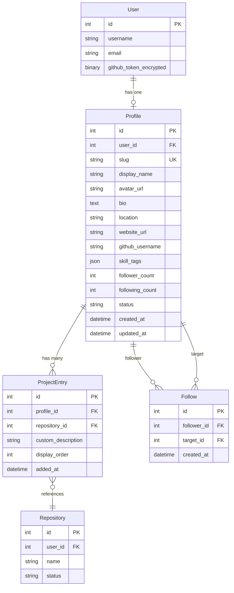

# Technical Design Document

## Overview

Developer Profiles with Project Pages creates the identity layer for the Developer Super-App. This feature provides developers with a LinkedIn-style professional profile where they curate their identity, skills, and projects. The key differentiator is user-controlled profile data—GitHub OAuth is used only for authentication, with an optional convenience feature to import avatar and bio. Each profile includes a projects section that links directly to the AI Codebase Explorer, creating a seamless flow from identity to work.

**Key Design Principles:**
- User-owned profile data (not automatically synced from GitHub)
- Clean separation between authentication (GitHub OAuth) and profile data
- Seamless integration with existing AI Codebase Explorer
- RESTful API design for frontend consumption
- Support for networking (follow/unfollow) as foundation for future social features

**Integration Points:**
- Extends existing `explorer.User` model with profile relationship
- Reuses existing GitHub OAuth pipeline from `explorer.authentication` and `explorer.auth_services`
- Links to existing `explorer.Repository` model for project showcase
- Maintains existing DRF authentication pattern with `CorsSessionAuthentication`


## Architecture

### High-Level Architecture

```
┌─────────────────────────────────────────────────────────────────────┐
│                          Next.js Frontend                           │
│  ┌──────────────┐  ┌──────────────┐  ┌──────────────────────────┐  │
│  │   Profile    │  │   Project    │  │  Follow/Network          │  │
│  │   Pages      │  │   Showcase   │  │  Management              │  │
│  └──────────────┘  └──────────────┘  └──────────────────────────┘  │
└─────────────────────────────────────────────────────────────────────┘
                              │
                              │ REST API (JSON)
                              ▼
┌─────────────────────────────────────────────────────────────────────┐
│                       Django REST Framework                         │
│  ┌──────────────┐  ┌──────────────┐  ┌──────────────────────────┐  │
│  │  Profile API │  │  Project API │  │  Follow API              │  │
│  │  Endpoints   │  │  Endpoints   │  │  Endpoints               │  │
│  └──────────────┘  └──────────────┘  └──────────────────────────┘  │
└─────────────────────────────────────────────────────────────────────┘
                              │
                              ▼
┌─────────────────────────────────────────────────────────────────────┐
│                      Django ORM (SQLite/PostgreSQL)                 │
│  ┌──────────────┐  ┌──────────────┐  ┌──────────────────────────┐  │
│  │   Profile    │  │ ProjectEntry │  │  Follow                  │  │
│  │   Model      │  │   Model      │  │  Model                   │  │
│  └──────────────┘  └──────────────┘  └──────────────────────────┘  │
│                                                                      │
│  Existing: User, Repository (from explorer app)                     │
└─────────────────────────────────────────────────────────────────────┘
```

### Layered Architecture


The feature is implemented as a new Django app `profiles` that extends the existing `explorer` app:

- **`profiles/models.py`** — `Profile`, `ProjectEntry`, `Follow` models
- **`profiles/serializers.py`** — DRF serializers for all models, handling both public (visitor) and private (owner) views
- **`profiles/views.py`** — DRF API views for all profile and follow endpoints
- **`profiles/services.py`** — Business logic for slug validation, GitHub import, and follow count management
- **`profiles/urls.py`** — URL routing for the `profiles` app
- **`profiles/permissions.py`** — Custom DRF permission classes for profile ownership checks

### App Structure

```
profiles/
├── __init__.py
├── admin.py
├── apps.py
├── migrations/
├── models.py
├── serializers.py
├── services.py
├── views.py
├── urls.py
└── permissions.py
```

### New Django App Registration

The `profiles` app is added to `INSTALLED_APPS` in `devconnpf/settings.py` and the `profiles.urls` is included under `/api/profiles/` in `devconnpf/urls.py`.


## Components and Interfaces

### Django Components

#### ProfileService (`profiles/services.py`)

Handles business logic that doesn't belong in models or views:

```python
class ProfileService:
    RESERVED_SLUGS = frozenset([
        "admin", "api", "auth", "settings", "dashboard",
        "login", "explore", "shared", "repos", "search",
    ])
    SLUG_PATTERN = re.compile(r'^[a-z][a-z0-9\-]{2,39}$')

    def validate_slug(self, slug: str, exclude_profile_id: int | None = None) -> None:
        """Validate slug format, reserved words, and uniqueness. Raises ValidationError."""

    def is_slug_available(self, slug: str, exclude_profile_id: int | None = None) -> bool:
        """Returns True if the slug is available for use."""
```

#### GitHubImportService (`profiles/services.py`)

```python
class GitHubImportService:
    GITHUB_USER_URL = "https://api.github.com/user"
    TIMEOUT_SECONDS = 10

    def fetch_github_profile(self, user) -> dict:
        """Fetch avatar_url, name, bio from GitHub API using stored token.
        Raises GitHubImportError on failure, GitHubTokenMissingError if no token."""
```

#### FollowService (`profiles/services.py`)

```python
class FollowService:
    def follow(self, follower: Profile, target: Profile) -> Follow:
        """Create follow relationship. Raises ValidationError on self-follow."""

    def unfollow(self, follower: Profile, target: Profile) -> None:
        """Remove follow relationship. Raises Follow.DoesNotExist if not following."""

    def sync_counts(self, profile: Profile) -> None:
        """Sync follower_count and following_count from actual Follow records."""
```


#### DRF Serializers (`profiles/serializers.py`)

```python
class ProfilePublicSerializer(serializers.ModelSerializer):
    """Public-facing profile serializer for visitors."""
    skill_tags = serializers.ListField(child=serializers.CharField())
    projects = serializers.SerializerMethodField()

    class Meta:
        model = Profile
        fields = ['slug', 'display_name', 'avatar_url', 'bio', 'location',
                  'website_url', 'skill_tags', 'follower_count', 'following_count',
                  'projects', 'joined_date', 'github_username']

class ProfileOwnerSerializer(ProfilePublicSerializer):
    """Extended serializer for profile owner with private fields."""
    email = serializers.EmailField(source='user.email', read_only=True)

    class Meta(ProfilePublicSerializer.Meta):
        fields = ProfilePublicSerializer.Meta.fields + ['email', 'github_sync_status']

class ProjectEntrySerializer(serializers.ModelSerializer):
    repository_name = serializers.CharField(source='repository.name', read_only=True)
    primary_language = serializers.CharField(source='repository.language', read_only=True)
    explorer_link = serializers.SerializerMethodField()

    class Meta:
        model = ProjectEntry
        fields = ['id', 'repository_name', 'custom_description', 'primary_language',
                  'explorer_link', 'display_order', 'added_at']
```


#### DRF Views (`profiles/views.py`)

```python
# Profile CRUD
@api_view(['POST'])
@permission_classes([IsAuthenticated])
def create_profile_view(request):
    """Create profile during onboarding. One profile per user."""

@api_view(['GET'])
@permission_classes([AllowAny])
def get_profile_view(request, slug):
    """Get profile by slug. Returns public or owner serialization based on auth."""

@api_view(['PUT', 'PATCH'])
@permission_classes([IsAuthenticated])
def update_profile_view(request, slug):
    """Update profile. Only owner can update."""

# GitHub Import
@api_view(['GET'])
@permission_classes([IsAuthenticated])
def github_import_preview_view(request):
    """Fetch GitHub profile data for review."""

@api_view(['POST'])
@permission_classes([IsAuthenticated])
def github_import_apply_view(request):
    """Apply selected GitHub data to profile."""

# Project Management
@api_view(['POST'])
@permission_classes([IsAuthenticated])
def add_project_view(request):
    """Add ProjectEntry to authenticated user's profile."""

@api_view(['DELETE'])
@permission_classes([IsAuthenticated])
def remove_project_view(request, project_id):
    """Remove ProjectEntry."""

@api_view(['PUT'])
@permission_classes([IsAuthenticated])
def reorder_projects_view(request):
    """Update display_order for multiple ProjectEntries."""
```


```python
# Follow Management
@api_view(['POST'])
@permission_classes([IsAuthenticated])
def follow_user_view(request, slug):
    """Follow a user by slug."""

@api_view(['DELETE'])
@permission_classes([IsAuthenticated])
def unfollow_user_view(request, slug):
    """Unfollow a user by slug."""

@api_view(['GET'])
@permission_classes([IsAuthenticated])
def followers_list_view(request, slug):
    """Get paginated list of followers."""

@api_view(['GET'])
@permission_classes([IsAuthenticated])
def following_list_view(request, slug):
    """Get paginated list of following."""

# Search and Discovery
@api_view(['GET'])
@permission_classes([AllowAny])
def search_profiles_view(request):
    """Search profiles by query string. Supports skill_tag filter."""
```

#### URL Routing (`profiles/urls.py`)

```python
urlpatterns = [
    path('me/', create_or_get_my_profile_view, name='my_profile'),
    path('me/github/preview/', github_import_preview_view, name='github_import_preview'),
    path('me/github/apply/', github_import_apply_view, name='github_import_apply'),
    path('me/projects/', add_project_view, name='add_project'),
    path('me/projects/<int:project_id>/', remove_project_view, name='remove_project'),
    path('me/projects/reorder/', reorder_projects_view, name='reorder_projects'),
    path('search/', search_profiles_view, name='search_profiles'),
    path('<slug:slug>/', get_profile_view, name='get_profile'),
    path('<slug:slug>/update/', update_profile_view, name='update_profile'),
    path('<slug:slug>/follow/', follow_user_view, name='follow_user'),
    path('<slug:slug>/unfollow/', unfollow_user_view, name='unfollow_user'),
    path('<slug:slug>/followers/', followers_list_view, name='followers_list'),
    path('<slug:slug>/following/', following_list_view, name='following_list'),
]
```


### Frontend Components (Next.js)

#### Page Structure

```
frontend/app/
├── (app)/                           # Authenticated layout
│   ├── onboarding/
│   │   └── page.tsx                 # Onboarding flow for new users
│   ├── profile/
│   │   ├── edit/
│   │   │   └── page.tsx             # Profile editing form
│   │   └── projects/
│   │       └── page.tsx             # Project management UI
│   └── [slug]/                      # Dynamic profile pages
│       └── page.tsx                 # Public profile view
├── (public)/                        # Public layout (no auth required)
│   └── [slug]/
│       └── page.tsx                 # Public profile view (alias)
└── search/
    └── page.tsx                     # Profile discovery and search
```

#### Component Hierarchy

```
ProfilePage
├── ProfileHeader (avatar, name, bio, stats, follow button)
├── ProfileStats (follower/following counts)
├── SkillTagList (skill badges)
└── ProjectShowcase
    └── ProjectCard[] (name, description, language, explorer link)

ProfileEditForm
├── BasicInfoSection (display name, bio, location, website)
├── AvatarUpload
├── SkillTagEditor (add/remove tags)
└── GitHubImportButton (optional import flow)

OnboardingFlow
├── WelcomeStep (intro message)
├── BasicInfoStep (required fields: display_name, slug)
└── OptionalInfoStep (bio, skills, avatar)

ProjectManagementPanel
├── AddProjectButton (select from user repositories)
├── ProjectList
│   └── ProjectItem[] (drag to reorder, edit description, remove)
└── ProjectLimitIndicator (shows X/50 projects)
```


#### React Query Hooks

```typescript
// Profile hooks
useProfile(slug: string) // Fetch profile by slug
useMyProfile() // Fetch authenticated user's profile
useCreateProfile(data: ProfileCreateData) // Create profile (onboarding)
useUpdateProfile(slug: string, data: ProfileUpdateData) // Update profile

// GitHub import hooks
useGitHubImportPreview() // Fetch GitHub profile data
useApplyGitHubImport(selectedFields: string[]) // Apply imported data

// Project hooks
useAddProject(data: ProjectAddData) // Add project to profile
useRemoveProject(projectId: number) // Remove project
useReorderProjects(projectOrders: {id: number, display_order: number}[]) // Reorder projects

// Follow hooks
useFollow(slug: string) // Follow user
useUnfollow(slug: string) // Unfollow user
useFollowers(slug: string, page?: number) // Get followers list
useFollowing(slug: string, page?: number) // Get following list

// Search hooks
useSearchProfiles(query: string, skillTag?: string, page?: number) // Search profiles
```

#### API Client (`lib/api/profiles.ts`)

```typescript
export const profilesApi = {
  getProfile: (slug: string) => fetch(`/api/profiles/${slug}/`),
  getMyProfile: () => fetch('/api/profiles/me/'),
  createProfile: (data: ProfileCreateData) => fetch('/api/profiles/me/', {method: 'POST', body: JSON.stringify(data)}),
  updateProfile: (slug: string, data: ProfileUpdateData) => fetch(`/api/profiles/${slug}/update/`, {method: 'PUT', body: JSON.stringify(data)}),
  
  previewGitHubImport: () => fetch('/api/profiles/me/github/preview/'),
  applyGitHubImport: (fields: string[]) => fetch('/api/profiles/me/github/apply/', {method: 'POST', body: JSON.stringify({fields})}),
  
  addProject: (repositoryId: number, description: string) => fetch('/api/profiles/me/projects/', {method: 'POST', body: JSON.stringify({repository_id: repositoryId, custom_description: description})}),
  removeProject: (projectId: number) => fetch(`/api/profiles/me/projects/${projectId}/`, {method: 'DELETE'}),
  reorderProjects: (orders: {id: number, display_order: number}[]) => fetch('/api/profiles/me/projects/reorder/', {method: 'PUT', body: JSON.stringify({projects: orders})}),
  
  followUser: (slug: string) => fetch(`/api/profiles/${slug}/follow/`, {method: 'POST'}),
  unfollowUser: (slug: string) => fetch(`/api/profiles/${slug}/unfollow/`, {method: 'DELETE'}),
  getFollowers: (slug: string, page?: number) => fetch(`/api/profiles/${slug}/followers/?page=${page || 1}`),
  getFollowing: (slug: string, page?: number) => fetch(`/api/profiles/${slug}/following/?page=${page || 1}`),
  
  searchProfiles: (query: string, skillTag?: string, page?: number) => fetch(`/api/profiles/search/?q=${encodeURIComponent(query)}&skill_tag=${skillTag || ''}&page=${page || 1}`),
};
```


## Data Models

### Profile Model

```python
class Profile(models.Model):
    """Developer profile — user-controlled professional identity."""
    
    STATUS_CHOICES = [
        ('active', 'Active'),
        ('inactive', 'Inactive'),
    ]
    
    user = models.OneToOneField(
        User,
        on_delete=models.CASCADE,
        related_name='profile',
    )
    slug = models.SlugField(
        max_length=40,
        unique=True,
        validators=[
            MinLengthValidator(3),
            RegexValidator(
                regex=r'^[a-z][a-z0-9\-]*$',
                message='Slug must start with a letter and contain only lowercase letters, numbers, and hyphens.',
            ),
        ],
    )
    display_name = models.CharField(max_length=100)
    avatar_url = models.URLField(max_length=500, null=True, blank=True)
    bio = models.TextField(max_length=500, null=True, blank=True)
    location = models.CharField(max_length=100, null=True, blank=True)
    website_url = models.URLField(max_length=200, null=True, blank=True)
    github_username = models.CharField(max_length=39, null=True, blank=True)  # GitHub max is 39
    
    skill_tags = models.JSONField(default=list)  # List of strings, max 20 items
    
    follower_count = models.IntegerField(default=0)
    following_count = models.IntegerField(default=0)
    
    status = models.CharField(max_length=10, choices=STATUS_CHOICES, default='active')
    github_sync_status = models.CharField(max_length=20, null=True, blank=True)  # 'never', 'synced', 'failed'
    
    created_at = models.DateTimeField(auto_now_add=True)
    updated_at = models.DateTimeField(auto_now=True)
    
    class Meta:
        db_table = 'profiles_profile'
        indexes = [
            models.Index(fields=['slug'], name='profile_slug_idx'),
            models.Index(fields=['status'], name='profile_status_idx'),
        ]
    
    def __str__(self):
        return f"{self.display_name} (@{self.slug})"
```


### ProjectEntry Model

```python
class ProjectEntry(models.Model):
    """Link between a profile and a repository for project showcase."""
    
    profile = models.ForeignKey(
        Profile,
        on_delete=models.CASCADE,
        related_name='projects',
    )
    repository = models.ForeignKey(
        'explorer.Repository',
        on_delete=models.CASCADE,
        related_name='profile_entries',
    )
    custom_description = models.CharField(max_length=300, null=True, blank=True)
    display_order = models.IntegerField(default=0)
    added_at = models.DateTimeField(auto_now_add=True)
    
    class Meta:
        db_table = 'profiles_projectentry'
        ordering = ['display_order', '-added_at']
        constraints = [
            models.UniqueConstraint(
                fields=['profile', 'repository'],
                name='unique_profile_repository',
            ),
        ]
        indexes = [
            models.Index(fields=['profile', 'display_order'], name='project_profile_order_idx'),
        ]
    
    def __str__(self):
        return f"{self.profile.slug} - {self.repository.name}"
```

### Follow Model

```python
class Follow(models.Model):
    """Follow relationship between profiles."""
    
    follower = models.ForeignKey(
        Profile,
        on_delete=models.CASCADE,
        related_name='following_set',
    )
    target = models.ForeignKey(
        Profile,
        on_delete=models.CASCADE,
        related_name='follower_set',
    )
    created_at = models.DateTimeField(auto_now_add=True)
    
    class Meta:
        db_table = 'profiles_follow'
        constraints = [
            models.UniqueConstraint(
                fields=['follower', 'target'],
                name='unique_follow_relationship',
            ),
            models.CheckConstraint(
                check=~models.Q(follower=models.F('target')),
                name='no_self_follow',
            ),
        ]
        indexes = [
            models.Index(fields=['follower', '-created_at'], name='follow_follower_idx'),
            models.Index(fields=['target', '-created_at'], name='follow_target_idx'),
        ]
    
    def __str__(self):
        return f"{self.follower.slug} → {self.target.slug}"
```


### Database Schema Diagram




## Correctness Properties

*A property is a characteristic or behavior that should hold true across all valid executions of a system — essentially, a formal statement about what the system should do. Properties serve as the bridge between human-readable specifications and machine-verifiable correctness guarantees.*

### Property 1: Slug Format Validation

*For any* string input submitted as a profile slug, the validation logic SHALL accept it if and only if it matches all of these rules simultaneously: starts with a lowercase letter, contains only lowercase letters, digits, and hyphens, has a length between 3 and 40 characters inclusive, and is not in the reserved slug list. Any input violating any one of these rules SHALL be rejected with a validation error naming the violated rule.

**Validates: Requirements 1.3, 1.4, 3.5, 9.3, 9.4, 9.6**

---

### Property 2: Slug Uniqueness and Immediate Release

*For any* two distinct valid slugs A and B, if a profile currently holds slug A and the owner changes it to slug B, then immediately after the update: slug A SHALL return a 404 response and slug B SHALL return the profile. No two active profiles may share the same slug at any point in time.

**Validates: Requirements 1.3, 9.2**

---

### Property 3: Profile Serialization Completeness and Optional Field Nullability

*For any* valid Profile object, serializing it for a public visitor SHALL produce a response that (a) contains all required top-level keys: `slug`, `display_name`, `avatar_url`, `bio`, `location`, `website_url`, `skill_tags`, `follower_count`, `following_count`, `projects`, `joined_date`, `github_username`; and (b) for any optional field not set by the owner, the serialized value SHALL be `null` (the key must be present with a null value, not absent).

**Validates: Requirements 8.1, 8.4**

---

### Property 4: Owner vs. Visitor Serialization Difference

*For any* Profile, serializing it for the profile owner SHALL include the additional private fields `email` and `github_sync_status`, while serializing it for any other viewer SHALL exclude those fields entirely.

**Validates: Requirements 8.2, 8.3**

---

### Property 5: Serialization Round Trip

*For any* valid Profile object with any combination of field values, serializing it to a JSON representation and then deserializing that representation SHALL produce an object where every field value is identical to the original object.

**Validates: Requirements 8.5**

---

### Property 6: Project Entry Display Order Preservation

*For any* profile and any assignment of `display_order` values to its project entries, serializing the profile's projects list SHALL return the entries sorted in ascending order of `display_order`.

**Validates: Requirements 2.7, 5.6**

---

### Property 7: Project Entry Count Constraint

*For any* profile, it SHALL be possible to add project entries until the count reaches 50. Any attempt to add a project entry when the profile already contains 50 entries SHALL be rejected with an error. Removing a project entry from a profile at the limit SHALL immediately make it possible to add one more.

**Validates: Requirements 5.4, 5.8**

---

### Property 8: Duplicate Project Entry Rejection

*For any* profile and any repository already linked to that profile via a `ProjectEntry`, a second attempt to add the same repository SHALL be rejected and the profile's project list SHALL remain unchanged.

**Validates: Requirements 5.9**

---

### Property 9: Profile Immutability on Invalid Input

*For any* profile with any set of existing field values, submitting an update request that fails validation (invalid display_name length, invalid slug format, invalid avatar, oversized bio, etc.) SHALL return a 400 error AND leave the existing profile data entirely unchanged — the profile SHALL be identical before and after the failed update attempt.

**Validates: Requirements 3.4, 3.7, 3.8**

---

### Property 10: Non-Owner Update Rejection

*For any* profile and any authenticated user who is not the profile owner, any attempt to update the profile SHALL be rejected with a 403 response and the profile data SHALL remain unchanged.

**Validates: Requirements 3.2**

---

### Property 11: Follow Count Consistency Invariant

*For any* sequence of follow and unfollow operations on any set of profiles, the `follower_count` of each profile SHALL equal the actual number of `Follow` records where that profile is the `target`, and the `following_count` SHALL equal the actual number of `Follow` records where that profile is the `follower`.

**Validates: Requirements 6.7**

---

### Property 12: Follow Idempotence

*For any* authenticated user following another user they already follow, the operation SHALL return the existing relationship without creating a duplicate Follow record — the total number of Follow records SHALL remain unchanged.

**Validates: Requirements 6.4**

---

### Property 13: Self-Follow Rejection

*For any* authenticated user, an attempt to follow their own profile SHALL be rejected with a validation error, and no Follow record SHALL be created.

**Validates: Requirements 6.3**

---

### Property 14: Follow/Unfollow Round Trip

*For any* pair of distinct profiles A and B, if A follows B and then A unfollows B, the Follow relationship SHALL no longer exist, and both profiles' follower/following counts SHALL be restored to their pre-follow values.

**Validates: Requirements 6.1, 6.2, 6.7**

---

### Property 15: Paginated Follow Lists Ordering

*For any* profile with N followers (or N following), requesting the followers (or following) list SHALL return results ordered by follow creation date descending, with pages of up to 20 results by default and up to 100 when specified, such that every follow relationship appears in exactly one page position and no relationship is duplicated or omitted across all pages.

**Validates: Requirements 6.8, 6.9**

---

### Property 16: Search Inclusivity and Active-Only Invariant

*For any* search query Q (between 1 and 200 characters), the search results SHALL contain all active profiles where Q is a case-insensitive substring of `display_name`, `username`, `bio`, or any element of `skill_tags`, and SHALL NOT contain any inactive profile regardless of how well it matches Q.

**Validates: Requirements 7.1, 7.4**

---

### Property 17: Skill Tag Filter Correctness

*For any* skill tag filter value T, all profiles returned by a filtered search SHALL contain T as an element of their `skill_tags`, and no profile returned SHALL lack T in its `skill_tags`.

**Validates: Requirements 7.3**

---

### Property 18: GitHub Import Selective Field Application

*For any* profile owner with a valid GitHub token, and any non-empty subset S of importable fields (`avatar_url`, `display_name`, `bio`), applying a GitHub import with selected fields S SHALL update exactly the fields in S on the profile and SHALL leave all fields not in S unchanged.

**Validates: Requirements 4.3**

---

### Property 19: GitHub Import Null Field Omission

*For any* GitHub API response where a subset of the fields (`avatar_url`, `name`, `bio`) is null or empty, the preview response SHALL omit those null/empty fields, and applying the import SHALL NOT overwrite the corresponding profile fields.

**Validates: Requirements 4.7**

---

### Property 20: GitHub Import Failure Preserves Profile

*For any* profile and any GitHub API failure (network error, timeout, 401, 403, 5xx), the import operation SHALL return an error response AND the profile data SHALL be identical before and after the failed import attempt.

**Validates: Requirements 4.4**

---

### Property 21: Skill Tags Serialized Without Truncation

*For any* profile with between 0 and 20 skill tags, serializing the profile SHALL produce a `skill_tags` array containing exactly all tags in the profile with no modification, truncation, or ordering change.

**Validates: Requirements 2.3**


## Error Handling

### Validation Errors

All validation failures return a 400 Bad Request response with a structured JSON body containing field-level error descriptions:

```json
{
  "error": "Validation failed",
  "fields": {
    "slug": ["Slug must start with a lowercase letter"],
    "bio": ["Bio must be 500 characters or fewer"]
  }
}
```

**Validation Rules:**
- `display_name`: Required, 2–100 characters
- `slug`: Required, 3–40 characters, must match `/^[a-z][a-z0-9\-]*$/`, unique, not reserved
- `bio`: Optional, max 500 characters
- `location`: Optional, max 100 characters
- `website_url`: Optional, max 200 characters, valid HTTP(S) URL
- `avatar_url`: Optional, valid URL, or uploaded file (PNG/JPEG/WebP, max 2MB)
- `skill_tags`: Optional, array of strings, max 20 items, each max 50 characters
- `custom_description` (ProjectEntry): Optional, max 300 characters

### Authorization Errors

- **403 Forbidden**: User attempts to update a profile they don't own
- **403 Forbidden**: User attempts to add a ProjectEntry for a repository they don't own

### Not Found Errors

- **404 Not Found**: Requested slug doesn't correspond to an active profile
- **404 Not Found**: Requested Follow relationship doesn't exist (on unfollow)
- **404 Not Found**: Requested repository doesn't exist or isn't owned by the user

### GitHub Import Errors

- **400 Bad Request**: GitHub token missing or expired (prompt to re-authenticate)
- **500 Internal Server Error**: GitHub API timeout (10 seconds) or network error

### Conflict Errors

- **409 Conflict**: Slug already taken by another active profile
- **409 Conflict**: ProjectEntry already exists for this profile-repository combination

### Quota Errors

- **429 Too Many Requests**: Rate limit exceeded (follows DRF's default throttle configuration)
- **400 Bad Request**: Profile already has 50 ProjectEntries


## Testing Strategy

### Dual Testing Approach

The Developer Profiles feature uses **both property-based tests and example-based unit tests** to achieve comprehensive coverage:

- **Property-Based Tests**: Verify universal properties across many generated inputs (100+ iterations per property) for core business logic and data validation rules
- **Unit Tests**: Verify specific examples, integration points, and edge cases not suitable for property-based testing

### Property-Based Testing Configuration

**Library**: The implementation will use a property-based testing library appropriate for the target language (e.g., Hypothesis for Python, fast-check for TypeScript).

**Iteration Count**: Minimum 100 iterations per property test to ensure adequate coverage of the input space.

**Test Annotations**: Each property test must reference its design document property using the following comment format:

```python
# Feature: developer-profiles, Property 1: Slug Format Validation
def test_slug_format_validation_property():
    # Test implementation
```

**Implementation Pattern**: Each correctness property from the design document SHALL be implemented as a SINGLE property-based test that generates appropriate random inputs and verifies the property holds.

### Test Organization

```
profiles/
└── tests/
    ├── __init__.py
    ├── test_properties.py          # Property-based tests for correctness properties
    ├── test_models.py               # Unit tests for model constraints and methods
    ├── test_serializers.py          # Unit tests for serialization edge cases
    ├── test_services.py             # Unit tests for business logic services
    ├── test_views.py                # Integration tests for API endpoints
    └── test_github_import.py        # Unit tests for GitHub import with mocked API
```


### Property Test Strategy

| Property | Test Approach | Generated Inputs |
|---|---|---|
| P1: Slug Format Validation | Generate strings with various violations | Random strings, boundary lengths, chars outside pattern, reserved slugs |
| P2: Slug Uniqueness + Release | Generate slug pairs | Two valid slugs; verify state before/after change |
| P3: Serialization Completeness | Generate diverse profiles | Profiles with all combinations of optional fields set/unset |
| P4: Owner vs Visitor Serialization | Generate profiles + multiple viewers | Profile + authenticated owner + anonymous + other user |
| P5: Serialization Round Trip | Generate valid profile data | Random profile field values within valid ranges |
| P6: Project Display Order | Generate project sets with random orders | Lists of projects with shuffled display_order values |
| P7: Project Count Constraint | Generate project count scenarios | Profiles at various counts from 0 to 51 |
| P8: Duplicate Project Rejection | Generate profile + repository pairs | Profile + same repository attempted twice |
| P9: Immutability on Invalid Input | Generate invalid update payloads | Profiles with current valid data + invalid updates |
| P10: Non-Owner Rejection | Generate profiles + non-owner users | Any profile + any user who is not the owner |
| P11: Follow Count Consistency | Generate follow/unfollow sequences | Random sequences of follow/unfollow operations |
| P12: Follow Idempotence | Generate existing follow pairs | Already-following pairs; repeat follow operation |
| P13: Self-Follow Rejection | Generate any profile | Any profile (follows itself) |
| P14: Follow/Unfollow Round Trip | Generate follow pairs | Any two distinct profiles |
| P15: Paginated Follow Lists | Generate follower sets | Various sizes of follower/following relationships |
| P16: Search Inclusivity + Active-Only | Generate profile sets + queries | Profiles (active + inactive) + search queries |
| P17: Skill Tag Filter | Generate profiles with tags + filters | Profiles with various tag sets, filter by specific tags |
| P18: GitHub Import Selective Apply | Generate importable field subsets | Any non-empty subset of {avatar_url, display_name, bio} |
| P19: GitHub Import Null Omission | Generate GitHub API responses | Responses with various combinations of null/empty fields |
| P20: GitHub Import Failure Preservation | Generate GitHub API failure modes | Mocked API failures (timeout, 401, 500) |
| P21: Skill Tags Without Truncation | Generate tag lists | Lists of 0–20 tags with various content |

### Unit Test Coverage

**Smoke Tests** (single execution):
- `test_profile_url_routing_exists`: Verify `/{slug}` route is registered
- `test_anonymous_profile_access`: Verify unauthenticated access returns 200
- `test_reserved_slug_list_contains_required_entries`: Verify `ProfileService.RESERVED_SLUGS` contains all required values

**Example Tests**:
- Profile creation with status='active' stored correctly
- Non-existent slug returns 404
- Inactive profile returns 404
- Empty skill_tags serialized as `[]`
- Empty projects serialized as `[]`
- New profile has follower_count=0 and following_count=0
- Unfollow when not following returns 404
- Search with no matches returns empty list with total=0
- Non-existent profile serialization returns 404
- GitHub import preview shows current vs. GitHub values side-by-side
- User without GitHub token receives appropriate error message
- GitHub 401 response generates re-authenticate error

**Integration Tests** (GitHub Import):
- Mock GitHub API returns expected data shape
- GitHub API timeout (10s) handled gracefully
- Stored encrypted token used for GitHub API call

### Frontend Testing Strategy

- **Component tests** (Vitest + React Testing Library): Test ProfileHeader, SkillTagList, ProjectShowcase, OnboardingFlow components with mocked API responses
- **API hook tests**: Test React Query hooks with mocked `profilesApi` client
- **Page-level tests**: Test routing, onboarding redirect, profile page rendering
- **No property tests on frontend**: UI components use example-based tests with specific input/output pairs

