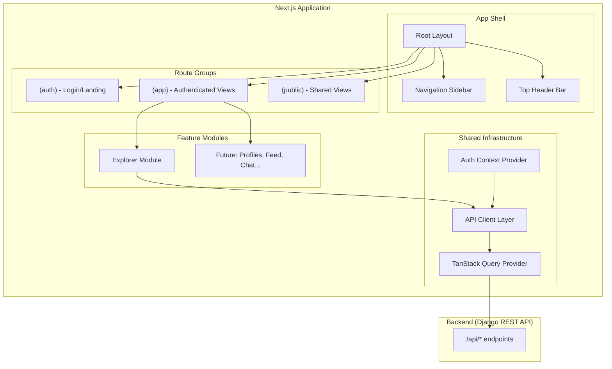
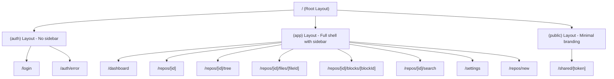
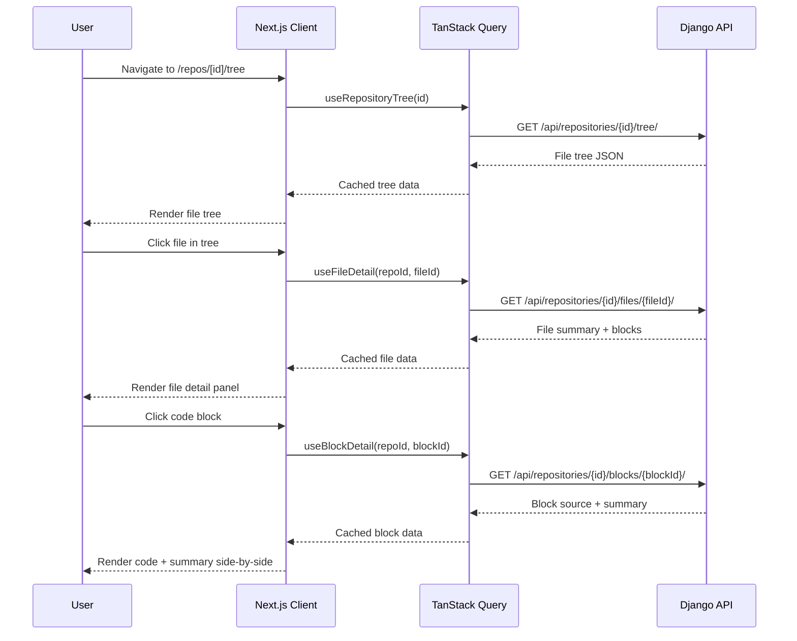
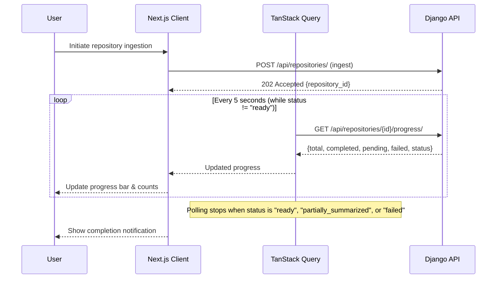

# Design Document: Explorer Frontend

## Overview

The Explorer Frontend is a Next.js 14+ (App Router) application that serves as the client-side interface for the AI Codebase Explorer. It consumes the existing Django REST API to provide repository browsing, AI-generated summary viewing, natural language search, and public sharing capabilities. The frontend is built with TypeScript, Tailwind CSS, and shadcn/ui components, using TanStack Query (React Query) for server state management.

The application is designed as the first module within a Developer Super-App shell. The routing structure, layout system, and component architecture are intentionally extensible to accommodate future modules (developer profiles, social feed, messaging, blog platform, integrated IDE) without requiring architectural changes to the shell.

### Key Design Decisions

| Decision | Choice | Rationale |
|----------|--------|-----------|
| Framework | Next.js 14+ (App Router) | Server components for SEO, streaming, and layout nesting; ideal for multi-module super-app |
| Language | TypeScript (strict mode) | Type safety across API boundaries; catches integration errors at compile time |
| Styling | Tailwind CSS + shadcn/ui | Utility-first CSS with accessible, composable component primitives |
| Data Fetching | TanStack Query v5 | Declarative caching, background refetching, optimistic updates, polling support |
| State Management | React Context (auth) + TanStack Query (server state) | Minimal client state; server is source of truth |
| API Client | Fetch wrapper with typed responses | Lightweight, no extra dependency; works in both server and client components |
| Routing | App Router with route groups | Parallel layouts for authenticated vs public views; future module isolation |
| Real-time Updates | Polling (5s interval) | Matches backend design; upgrade path to WebSocket/SSE later |

---

## Architecture

### High-Level System Architecture



### Routing & Layout Structure



### Data Flow: Repository Browsing



### Progress Polling Flow



---

## Components and Interfaces

### 1. API Client Layer (`lib/api/`)

**Purpose**: Type-safe HTTP client wrapping all backend API calls with error handling, auth token forwarding, and response parsing.

```typescript
// lib/api/client.ts
interface ApiClientConfig {
  baseUrl: string;
  credentials: "include" | "same-origin";
}

class ApiClient {
  constructor(config: ApiClientConfig);
  get<T>(path: string, params?: Record<string, string>): Promise<T>;
  post<T>(path: string, body?: unknown): Promise<T>;
  put<T>(path: string, body?: unknown): Promise<T>;
  delete<T>(path: string): Promise<T>;
}
```

**Responsibilities**:
- Prepend base URL to all requests
- Include credentials (cookies) for session-based auth
- Parse JSON responses with type assertions
- Throw typed `ApiError` on non-2xx responses
- Handle 401 by redirecting to login

### 2. Auth Context (`lib/auth/`)

**Purpose**: Manage authentication state, provide login/logout actions, and gate access to protected routes.

```typescript
// lib/auth/auth-context.tsx
interface AuthState {
  user: User | null;
  isAuthenticated: boolean;
  isLoading: boolean;
}

interface AuthActions {
  login(): void;           // Redirect to GitHub OAuth
  logout(): Promise<void>; // POST /api/auth/logout/
}

type AuthContextValue = AuthState & AuthActions;
```

**Responsibilities**:
- Provide auth state to entire app via React Context
- Redirect unauthenticated users from protected routes
- Handle OAuth callback errors
- Clear local state on logout

### 3. TanStack Query Hooks (`lib/hooks/`)

**Purpose**: Encapsulate all API calls as declarative query/mutation hooks with caching, polling, and error handling.

```typescript
// lib/hooks/use-repository-tree.ts
function useRepositoryTree(repoId: number): UseQueryResult<FileTreeNode[]>;

// lib/hooks/use-file-detail.ts
function useFileDetail(repoId: number, fileId: number): UseQueryResult<FileDetail>;

// lib/hooks/use-block-detail.ts
function useBlockDetail(repoId: number, blockId: number): UseQueryResult<BlockDetail>;

// lib/hooks/use-repository-progress.ts
function useRepositoryProgress(repoId: number, options?: {
  enabled?: boolean;
  refetchInterval?: number; // Default: 5000ms
}): UseQueryResult<ProgressReport>;

// lib/hooks/use-search.ts
function useSearch(repoId: number, query: string): UseQueryResult<SearchResult[]>;

// lib/hooks/use-sharing.ts
function useEnableSharing(repoId: number): UseMutationResult<ShareInfo>;
function useDisableSharing(repoId: number): UseMutationResult<void>;
function useRegenerateShareUrl(repoId: number): UseMutationResult<ShareInfo>;

// lib/hooks/use-language-preference.ts
function useUpdateLanguage(): UseMutationResult<void, Error, LanguageCode>;
```

### 4. File Tree Browser Component (`components/explorer/file-tree/`)

**Purpose**: Render the hierarchical repository structure with collapsible directories, summary previews, and status indicators.

```typescript
// components/explorer/file-tree/file-tree.tsx
interface FileTreeProps {
  repoId: number;
  onFileSelect: (fileId: number) => void;
  onBlockSelect: (blockId: number) => void;
  selectedFileId?: number;
}

// components/explorer/file-tree/tree-node.tsx
interface TreeNodeProps {
  node: FileTreeNode;
  depth: number;
  isExpanded: boolean;
  onToggle: () => void;
  onSelect: () => void;
}
```

**Responsibilities**:
- Render directory hierarchy with expand/collapse
- Show 80-char summary preview next to each file
- Display status indicators (completed ✓, pending ⏳, failed ✗)
- Sort directories before files, alphabetical within each group
- Highlight currently selected file
- Lazy-load expanded directory contents

### 5. Search Interface (`components/explorer/search/`)

**Purpose**: Natural language search across AI summaries with highlighted results and navigation.

```typescript
// components/explorer/search/search-panel.tsx
interface SearchPanelProps {
  repoId: number;
  onResultSelect: (result: SearchResult) => void;
}

// components/explorer/search/search-result-item.tsx
interface SearchResultItemProps {
  result: SearchResult;
  onSelect: () => void;
}
```

**Responsibilities**:
- Debounced search input (300ms)
- Validate query length (3-300 chars) with inline feedback
- Display results with highlighted excerpts, file path, block name
- Navigate to file/block on result click
- Show empty state with refinement suggestions

### 6. Progress Tracker (`components/explorer/progress/`)

**Purpose**: Real-time progress display for repository ingestion and summarization.

```typescript
// components/explorer/progress/progress-panel.tsx
interface ProgressPanelProps {
  repoId: number;
  onComplete: () => void;
}

// Internal state derived from useRepositoryProgress hook
interface ProgressDisplay {
  percentage: number;        // completed / total * 100
  completedCount: number;
  pendingCount: number;
  failedCount: number;
  status: RepositoryStatus;
  statusLabel: string;       // Human-readable status
}
```

**Responsibilities**:
- Poll progress endpoint every 5 seconds
- Display animated progress bar with percentage
- Show completed/pending/failed counts
- Stop polling when terminal status reached
- Trigger completion callback for navigation

### 7. Sharing Management (`components/explorer/sharing/`)

**Purpose**: Enable/disable/regenerate public share URLs with copy-to-clipboard.

```typescript
// components/explorer/sharing/share-panel.tsx
interface SharePanelProps {
  repoId: number;
  currentShareInfo: ShareInfo | null;
}

interface ShareInfo {
  token: string;
  url: string;
  isActive: boolean;
  createdAt: string;
}
```

**Responsibilities**:
- Toggle sharing on/off with confirmation dialog
- Display share URL with copy button
- Regenerate URL with warning about invalidating old link
- Show sharing status indicator

### 8. Public Shared View (`app/(public)/shared/[token]/`)

**Purpose**: Read-only repository view accessible without authentication.

```typescript
// app/(public)/shared/[token]/page.tsx
interface SharedViewProps {
  params: { token: string };
}
```

**Responsibilities**:
- Fetch repository data via public endpoint (no auth)
- Render file tree browser in read-only mode
- Enable search within shared repository
- Display attribution banner with owner username
- Show branding watermark ("Powered by DevConn")
- Handle 404 for invalid/expired tokens

---

## Data Models

### API Response Types

```typescript
// lib/types/api.ts

// --- Auth ---
interface User {
  id: number;
  username: string;
  email: string;
  languagePreference: LanguageCode;
  avatarUrl: string | null;
}

type LanguageCode = "en" | "es" | "fr" | "de" | "pt" | "ja" | "ko" | "zh";

// --- Repository ---
interface Repository {
  id: number;
  name: string;
  sourceType: "github" | "zip";
  githubFullName: string | null;
  status: RepositoryStatus;
  fileCount: number;
  totalSizeBytes: number;
  ingestedAt: string;  // ISO 8601
  updatedAt: string;
  shareInfo: ShareInfo | null;
}

type RepositoryStatus =
  | "cloning"
  | "extracting"
  | "parsing"
  | "summarizing"
  | "ready"
  | "partially_summarized"
  | "failed";

// --- File Tree ---
interface FileTreeNode {
  id: number;
  name: string;
  path: string;
  type: "file" | "directory";
  language: string | null;
  summaryPreview: string | null;  // Truncated to 80 chars
  summaryStatus: SummaryStatus;
  children: FileTreeNode[] | null; // null for files, array for dirs
}

type SummaryStatus = "completed" | "pending" | "failed" | "permanently_failed" | "not_applicable";
```

```typescript
// --- File Detail ---
interface FileDetail {
  id: number;
  path: string;
  filename: string;
  language: string;
  summary: FileSummary | null;
  blocks: BlockSummaryItem[];
}

interface FileSummary {
  text: string;
  status: SummaryStatus;
  language: LanguageCode;
  generatedAt: string | null;
  canRetry: boolean;
}

interface BlockSummaryItem {
  id: number;
  name: string;
  kind: "function" | "class" | "method" | "module_construct";
  startLine: number;
  endLine: number;
  summaryText: string | null;
  summaryStatus: SummaryStatus;
}

// --- Block Detail ---
interface BlockDetail {
  id: number;
  name: string;
  kind: string;
  startLine: number;
  endLine: number;
  sourceCode: string;
  summary: {
    text: string;
    status: SummaryStatus;
    language: LanguageCode;
    generatedAt: string | null;
  } | null;
  parentBlockName: string | null;
}

// --- Progress ---
interface ProgressReport {
  totalJobs: number;
  completed: number;
  pending: number;
  failed: number;
  status: RepositoryStatus;
}

// --- Search ---
interface SearchResult {
  filePath: string;
  blockName: string | null;
  summaryExcerpt: string;  // Up to 200 chars, match highlighted
  similarityRank: number;
  resultType: "file" | "block";
  fileId: number;
  blockId: number | null;
}

// --- Sharing ---
interface ShareInfo {
  token: string;
  url: string;
  isActive: boolean;
  createdAt: string;
}

// --- Errors ---
interface ApiError {
  status: number;
  message: string;
  detail?: string;
  code?: string;
}
```

### Client-Side State Models

```typescript
// lib/types/ui-state.ts

interface FileTreeState {
  expandedPaths: Set<string>;  // Tracks which directories are expanded
  selectedFileId: number | null;
  selectedBlockId: number | null;
}

interface SearchState {
  query: string;
  isSearching: boolean;
  results: SearchResult[];
  hasSearched: boolean;  // Distinguishes "no results" from "hasn't searched yet"
}

interface IngestionState {
  step: "select" | "uploading" | "processing" | "complete" | "error";
  repositoryId: number | null;
  error: string | null;
}
```

**Validation Rules**:
- `LanguageCode` must be one of the 8 supported values
- `FileTreeNode.summaryPreview` is always ≤ 80 characters
- `SearchResult.summaryExcerpt` is always ≤ 200 characters
- Search query must be 3-300 characters
- Repository limit per user: max 3

---

## Algorithmic Pseudocode

### File Tree Rendering Algorithm

```typescript
/**
 * Transforms flat file tree API response into a renderable
 * hierarchical structure with proper sort order.
 */
function buildRenderTree(nodes: FileTreeNode[], expandedPaths: Set<string>): RenderNode[] {
  // PRECONDITION: nodes is a valid array of FileTreeNode objects
  // POSTCONDITION: Returns sorted array where directories precede files,
  //   each group sorted alphabetically (case-insensitive)

  const sorted = [...nodes].sort((a, b) => {
    // Directories first
    if (a.type === "directory" && b.type === "file") return -1;
    if (a.type === "file" && b.type === "directory") return 1;
    // Alphabetical within same type (case-insensitive)
    return a.name.localeCompare(b.name, undefined, { sensitivity: "base" });
  });

  return sorted.map(node => ({
    ...node,
    isExpanded: expandedPaths.has(node.path),
    children: node.type === "directory" && expandedPaths.has(node.path)
      ? buildRenderTree(node.children ?? [], expandedPaths)
      : null,
  }));
}
```

### Progress Polling Algorithm

```typescript
/**
 * Manages polling lifecycle for repository progress tracking.
 * Polls every 5 seconds until a terminal status is reached.
 */
function useRepositoryProgress(repoId: number) {
  // PRECONDITION: repoId is a valid positive integer
  // POSTCONDITION: Returns current progress, stops polling on terminal status
  // LOOP INVARIANT: refetchInterval is active iff status is non-terminal

  const POLL_INTERVAL = 5000; // 5 seconds
  const TERMINAL_STATUSES: RepositoryStatus[] = [
    "ready", "partially_summarized", "failed"
  ];

  return useQuery({
    queryKey: ["repository-progress", repoId],
    queryFn: () => apiClient.get<ProgressReport>(
      `/api/repositories/${repoId}/progress/`
    ),
    refetchInterval: (query) => {
      const status = query.state.data?.status;
      if (status && TERMINAL_STATUSES.includes(status)) {
        return false; // Stop polling
      }
      return POLL_INTERVAL;
    },
  });
}
```

### Search Debounce Algorithm

```typescript
/**
 * Debounced search with validation and result caching.
 */
function useSearch(repoId: number, query: string) {
  // PRECONDITION: repoId > 0
  // POSTCONDITION: Returns results only for valid queries (3-300 chars)
  //   Results are cached per (repoId, query) pair

  const debouncedQuery = useDebounce(query, 300); // 300ms debounce
  const isValidQuery = debouncedQuery.length >= 3 && debouncedQuery.length <= 300;

  return useQuery({
    queryKey: ["search", repoId, debouncedQuery],
    queryFn: () => apiClient.get<SearchResult[]>(
      `/api/repositories/${repoId}/search/`,
      { q: debouncedQuery }
    ),
    enabled: isValidQuery, // Only fetch when query is valid
    staleTime: 30_000,     // Cache results for 30 seconds
  });
}
```

### Auth Guard Algorithm

```typescript
/**
 * Protects routes requiring authentication.
 * Redirects to login if session is invalid.
 */
function AuthGuard({ children }: { children: React.ReactNode }) {
  // PRECONDITION: AuthContext is available in component tree
  // POSTCONDITION: Renders children iff user is authenticated,
  //   otherwise redirects to /login

  const { isAuthenticated, isLoading } = useAuth();
  const router = useRouter();

  if (isLoading) {
    return <LoadingSkeleton />;
  }

  if (!isAuthenticated) {
    router.replace("/login");
    return null;
  }

  return <>{children}</>;
}
```

### API Error Handling Algorithm

```typescript
/**
 * Centralized error handler for API responses.
 * Maps HTTP status codes to user-facing actions.
 */
function handleApiError(error: ApiError): ErrorAction {
  // PRECONDITION: error has a valid status code
  // POSTCONDITION: Returns appropriate user-facing action

  switch (error.status) {
    case 401:
      // Session expired — redirect to login
      return { type: "redirect", target: "/login" };
    case 403:
      // Insufficient permissions
      return { type: "toast", message: "You don't have permission for this action" };
    case 404:
      // Resource not found
      return { type: "not-found" };
    case 429:
      // Rate limited
      return { type: "toast", message: "Too many requests. Please wait a moment." };
    default:
      // Generic server error
      return { type: "toast", message: error.message || "Something went wrong" };
  }
}
```

---

## Key Functions with Formal Specifications

### Function 1: buildRenderTree()

```typescript
function buildRenderTree(nodes: FileTreeNode[], expandedPaths: Set<string>): RenderNode[]
```

**Preconditions:**
- `nodes` is a non-null array of valid `FileTreeNode` objects
- `expandedPaths` is a valid `Set<string>`
- Each node has a non-empty `name` and valid `type` ("file" | "directory")

**Postconditions:**
- Returns array where all directory entries precede all file entries
- Within each group (dirs, files), entries are sorted alphabetically (case-insensitive)
- Directory nodes with paths in `expandedPaths` have their children recursively sorted
- No mutation of input arrays
- Output length equals input length

**Loop Invariants:**
- Sort comparator is transitive and consistent
- Recursive calls maintain the same sort invariant at every depth level

### Function 2: useRepositoryProgress()

```typescript
function useRepositoryProgress(repoId: number): UseQueryResult<ProgressReport>
```

**Preconditions:**
- `repoId` is a positive integer corresponding to an existing repository
- Component is wrapped in QueryClientProvider

**Postconditions:**
- Returns fresh progress data within 5 seconds of any backend state change
- Polling stops when status is one of: "ready", "partially_summarized", "failed"
- `completed + pending + failed === totalJobs` (invariant from backend)
- No polling occurs if component is unmounted

**Loop Invariants:**
- refetchInterval is active if and only if current status is non-terminal
- Each poll returns a ProgressReport where counts are monotonically non-decreasing for `completed`

### Function 3: useSearch()

```typescript
function useSearch(repoId: number, query: string): UseQueryResult<SearchResult[]>
```

**Preconditions:**
- `repoId` is a positive integer
- `query` is a string (may be any length; validation is internal)

**Postconditions:**
- Query is only executed if debounced query length is between 3 and 300 characters
- Results are scoped to the specified repository (no cross-repo leakage)
- Results are ordered by decreasing `similarityRank`
- Maximum 50 results returned
- Results are cached for 30 seconds per (repoId, query) pair

**Loop Invariants:** N/A (declarative hook, no loops)

### Function 4: handleApiError()

```typescript
function handleApiError(error: ApiError): ErrorAction
```

**Preconditions:**
- `error` is a non-null object with a numeric `status` field
- `error.message` is a string (may be empty)

**Postconditions:**
- Returns an `ErrorAction` for every possible HTTP status code
- 401 always produces a redirect to "/login"
- 404 always produces a "not-found" action
- No side effects (pure function)
- Never throws

**Loop Invariants:** N/A (no loops)

### Function 5: validateSearchQuery()

```typescript
function validateSearchQuery(query: string): ValidationResult
```

**Preconditions:**
- `query` is a string (may be empty)

**Postconditions:**
- Returns `{ valid: true }` if and only if `3 <= query.length <= 300`
- Returns `{ valid: false, reason: "too_short" }` if `query.length < 3`
- Returns `{ valid: false, reason: "too_long" }` if `query.length > 300`
- Pure function, no side effects

**Loop Invariants:** N/A

---

## Example Usage

```typescript
// Example 1: File Tree Page with selection handling
// app/(app)/repos/[id]/tree/page.tsx

export default function TreePage({ params }: { params: { id: string } }) {
  const repoId = parseInt(params.id);
  const router = useRouter();
  const { data: tree, isLoading } = useRepositoryTree(repoId);

  const handleFileSelect = (fileId: number) => {
    router.push(`/repos/${repoId}/files/${fileId}`);
  };

  if (isLoading) return <TreeSkeleton />;

  return (
    <FileTree
      repoId={repoId}
      onFileSelect={handleFileSelect}
      onBlockSelect={(blockId) => router.push(`/repos/${repoId}/blocks/${blockId}`)}
    />
  );
}

// Example 2: Progress tracking during ingestion
// components/explorer/progress/progress-panel.tsx

export function ProgressPanel({ repoId, onComplete }: ProgressPanelProps) {
  const { data: progress } = useRepositoryProgress(repoId);

  useEffect(() => {
    if (progress?.status === "ready") {
      onComplete();
    }
  }, [progress?.status, onComplete]);

  if (!progress) return <ProgressSkeleton />;

  const percentage = Math.round((progress.completed / progress.totalJobs) * 100);

  return (
    <div className="space-y-4">
      <Progress value={percentage} className="h-3" />
      <div className="flex justify-between text-sm text-muted-foreground">
        <span>{progress.completed} completed</span>
        <span>{progress.pending} pending</span>
        {progress.failed > 0 && (
          <span className="text-destructive">{progress.failed} failed</span>
        )}
      </div>
      <StatusBadge status={progress.status} />
    </div>
  );
}
```

```typescript
// Example 3: Search with debounce and validation
// components/explorer/search/search-panel.tsx

export function SearchPanel({ repoId, onResultSelect }: SearchPanelProps) {
  const [query, setQuery] = useState("");
  const { data: results, isLoading, isError } = useSearch(repoId, query);
  const validation = validateSearchQuery(query);

  return (
    <div className="space-y-4">
      <div className="relative">
        <Search className="absolute left-3 top-3 h-4 w-4 text-muted-foreground" />
        <Input
          placeholder="Search summaries... (e.g., 'where is auth handled')"
          value={query}
          onChange={(e) => setQuery(e.target.value)}
          className="pl-10"
        />
      </div>

      {!validation.valid && query.length > 0 && (
        <p className="text-sm text-muted-foreground">
          {validation.reason === "too_short"
            ? "Type at least 3 characters to search"
            : "Query must be 300 characters or less"}
        </p>
      )}

      {results?.length === 0 && (
        <EmptyState message="No matches found. Try different keywords." />
      )}

      {results?.map((result) => (
        <SearchResultItem
          key={`${result.fileId}-${result.blockId}`}
          result={result}
          onSelect={() => onResultSelect(result)}
        />
      ))}
    </div>
  );
}

// Example 4: Sharing management
// components/explorer/sharing/share-panel.tsx

export function SharePanel({ repoId, currentShareInfo }: SharePanelProps) {
  const enableSharing = useEnableSharing(repoId);
  const disableSharing = useDisableSharing(repoId);
  const regenerateUrl = useRegenerateShareUrl(repoId);

  return (
    <Card>
      <CardHeader>
        <CardTitle>Public Sharing</CardTitle>
      </CardHeader>
      <CardContent className="space-y-4">
        <div className="flex items-center justify-between">
          <Label>Enable public access</Label>
          <Switch
            checked={currentShareInfo?.isActive ?? false}
            onCheckedChange={(checked) =>
              checked ? enableSharing.mutate() : disableSharing.mutate()
            }
          />
        </div>

        {currentShareInfo?.isActive && (
          <>
            <div className="flex gap-2">
              <Input value={currentShareInfo.url} readOnly />
              <Button variant="outline" onClick={() => copyToClipboard(currentShareInfo.url)}>
                <Copy className="h-4 w-4" />
              </Button>
            </div>
            <Button variant="ghost" size="sm" onClick={() => regenerateUrl.mutate()}>
              Regenerate URL
            </Button>
          </>
        )}
      </CardContent>
    </Card>
  );
}
```

---

## Correctness Properties

*A property is a characteristic or behavior that should hold true across all valid executions of a system — essentially, a formal statement about what the system should do. Properties serve as the bridge between human-readable specifications and machine-verifiable correctness guarantees.*

### Property 1: File Tree Sort Order Consistency

*For any* array of `FileTreeNode` objects, `buildRenderTree()` SHALL produce an output where all directory entries appear before all file entries, directories are sorted alphabetically (case-insensitive) among themselves, and files are sorted alphabetically (case-insensitive) among themselves. This property holds recursively at every depth level.

**Validates: Requirements 5.2, 5.7**

### Property 2: Search Query Validation Completeness

*For any* string `s`, `validateSearchQuery(s)` SHALL return `{ valid: true }` if and only if `3 <= s.length <= 300`. For all other strings, it SHALL return `{ valid: false }` with the appropriate reason ("too_short" for length < 3, "too_long" for length > 300).

**Validates: Requirements 7.2, 7.3, 7.4**

### Property 3: Progress Percentage Bounds

*For any* `ProgressReport` where `totalJobs > 0`, the computed percentage `Math.round((completed / totalJobs) * 100)` SHALL be between 0 and 100 inclusive. Additionally, `completed + pending + failed === totalJobs` SHALL always hold.

**Validates: Requirements 10.2**

### Property 4: API Error Handler Totality

*For any* `ApiError` with a numeric `status` field (100-599), `handleApiError()` SHALL return a valid `ErrorAction` without throwing. Specifically: 401 produces a redirect to "/login", 403 produces a permission toast, 404 produces a not-found action, 429 produces a rate-limit toast, and all other codes produce a generic error toast.

**Validates: Requirements 12.1, 12.2, 12.3, 12.4, 12.5**

### Property 5: Polling Termination Guarantee

*For any* repository that reaches a terminal status ("ready", "partially_summarized", "failed"), the progress polling SHALL stop within one polling interval (5 seconds) of receiving that status. No further network requests are made after termination.

**Validates: Requirements 10.1, 10.4**

### Property 6: Summary Preview Truncation

*For any* string input to the truncation function, the output length SHALL be at most 80 characters. If the input exceeds 80 characters, the output SHALL end with "…" (ellipsis) and have a total length of exactly 80 characters.

**Validates: Requirements 5.4**

### Property 7: Search Excerpt Length Bound

*For any* `SearchResult` displayed by the Search_Interface, the `summaryExcerpt` field SHALL have a length of at most 200 characters.

**Validates: Requirements 7.5**

---

## Error Handling

### Error Scenario 1: Authentication Failure

**Condition**: GitHub OAuth returns an error, user denies authorization, or session expires mid-use.
**Response**: Display error message on `/auth/error` page with specific reason. For session expiry, show toast and redirect to login.
**Recovery**: User can retry login from the landing page. No data loss occurs.

### Error Scenario 2: Network Failure During API Calls

**Condition**: Backend is unreachable or request times out.
**Response**: TanStack Query retries failed requests 3 times with exponential backoff. After exhausting retries, display error boundary with "Connection lost" message.
**Recovery**: Automatic retry on reconnection. User can manually retry via "Try Again" button.

### Error Scenario 3: Repository Ingestion Failure

**Condition**: Backend reports ingestion failed (size limit, timeout, network error).
**Response**: Display specific error message from API response. Show "Retry" button for transient errors. Show limit information for size/count violations.
**Recovery**: User can retry ingestion or choose a different repository/file.

### Error Scenario 4: Progress Polling Failure

**Condition**: Progress endpoint returns error during polling.
**Response**: Continue polling (transient errors are expected). After 3 consecutive failures, show warning banner but don't stop polling.
**Recovery**: Polling auto-recovers when endpoint becomes available again.

### Error Scenario 5: Invalid Share Token

**Condition**: User navigates to `/shared/[token]` with an invalid, expired, or revoked token.
**Response**: Display 404 page with message "This shared repository is no longer available."
**Recovery**: No recovery needed — link is permanently invalid.

### Error Scenario 6: Repository Limit Reached

**Condition**: User attempts to ingest a 4th repository (max 3 per user).
**Response**: Display message explaining the limit. Show existing repositories with option to delete one.
**Recovery**: User deletes an existing repository to free a slot.

---

## Testing Strategy

### Unit Testing Approach

**Framework**: Vitest + React Testing Library

**Key test areas**:
- Component rendering with various data states (loading, error, empty, populated)
- User interactions (click, type, toggle) produce correct state changes
- Conditional rendering based on auth state, repository status, summary status
- Sort algorithm correctness for file tree
- Query validation logic
- Error handler mapping

**Coverage goals**: 80%+ for utility functions, 70%+ for components

### Property-Based Testing Approach

**Library**: fast-check (TypeScript property-based testing)

**Properties to test**:
| Property | Module Under Test | Key Generators |
|----------|-------------------|----------------|
| 1: File Tree Sort Order | `lib/utils/tree-sort` | Random arrays of FileTreeNode with mixed types |
| 2: Search Query Validation | `lib/utils/validation` | Random strings of varying lengths (0-1000) |
| 3: Progress Percentage Bounds | `lib/utils/progress` | Random ProgressReport with valid counts |
| 4: API Error Handler Totality | `lib/api/error-handler` | Random integers (100-599) as status codes |
| 5: Polling Termination | `lib/hooks/use-progress` | Random sequences of ProgressReport with terminal status |
| 6: Summary Preview Truncation | `lib/utils/truncate` | Random strings of varying lengths |

### Integration Testing Approach

**Framework**: Playwright for E2E tests

**Key flows**:
- Login → Dashboard → Repository ingestion → Progress → Browse tree
- File tree navigation → File detail → Block detail
- Search → Result selection → Navigation
- Sharing enable → Copy URL → Public view access
- Language preference change → Summary regeneration

### Component Testing

**Framework**: Vitest + Testing Library with MSW (Mock Service Worker)

**Strategy**: Mock API responses at the network level to test component behavior with realistic data flows without hitting the backend.

---

## Performance Considerations

### Data Fetching Optimization

- **Stale-while-revalidate**: TanStack Query serves cached data immediately while refetching in background
- **Query deduplication**: Multiple components requesting the same data share a single network request
- **Prefetching**: Prefetch file detail on hover over tree node (200ms delay) for instant navigation
- **Pagination**: File tree loads root level initially; subdirectories loaded on expand (lazy loading)
- **Search debounce**: 300ms debounce prevents excessive API calls during typing

### Rendering Optimization

- **Virtualized tree**: For repositories with 200+ files, use virtual scrolling (e.g., `@tanstack/react-virtual`)
- **React.memo**: Memoize tree nodes to prevent re-renders on sibling state changes
- **Code splitting**: Each route is a separate chunk; heavy components (code viewer) loaded lazily
- **Skeleton loading**: Show content placeholders during data fetching to prevent layout shift

### Bundle Size

- **Tree shaking**: Import only used shadcn/ui components
- **Dynamic imports**: Code syntax highlighting loaded only on block detail page
- **Image optimization**: Next.js Image component for avatars and branding assets

---

## Security Considerations

### Authentication

- Session cookies are `HttpOnly`, `Secure`, `SameSite=Lax`
- CSRF protection via Django's CSRF middleware (token in cookie, validated on mutations)
- OAuth state parameter validated to prevent CSRF on callback
- No access tokens stored in localStorage or client-side JavaScript

### API Security

- All authenticated API calls include credentials (cookies) — no bearer tokens in headers
- 401 responses trigger immediate redirect to login (no stale auth state)
- Rate limiting handled gracefully with user-facing feedback
- Input sanitization: search queries and file paths are never rendered as raw HTML

### Public Shared Views

- Share tokens are cryptographically random (≥22 URL-safe chars)
- Shared views expose only summary data — no source code in public view (blocks show summary only)
- Attribution banner cannot be removed or modified by URL manipulation
- No authentication cookies sent on public view requests

### Content Security

- CSP headers configured to prevent XSS
- Code blocks rendered with syntax highlighting library (no `dangerouslySetInnerHTML` on user content)
- File paths displayed as text, never as clickable links to external resources

---

## Dependencies

### Core Framework

| Package | Purpose | Version |
|---------|---------|---------|
| next | App Router framework | 14.x+ |
| react / react-dom | UI library | 18.x+ |
| typescript | Type safety | 5.x+ |

### Styling & UI

| Package | Purpose | Version |
|---------|---------|---------|
| tailwindcss | Utility-first CSS | 3.x+ |
| @radix-ui/* | Accessible primitives (via shadcn/ui) | latest |
| lucide-react | Icon library | latest |
| class-variance-authority | Component variant management | latest |
| clsx + tailwind-merge | Conditional class composition | latest |

### Data Fetching & State

| Package | Purpose | Version |
|---------|---------|---------|
| @tanstack/react-query | Server state management | 5.x+ |
| @tanstack/react-virtual | Virtual scrolling for large trees | 3.x+ |

### Testing

| Package | Purpose | Version |
|---------|---------|---------|
| vitest | Unit test runner | latest |
| @testing-library/react | Component testing | latest |
| fast-check | Property-based testing | latest |
| msw | API mocking | 2.x+ |
| @playwright/test | E2E testing | latest |

### Utilities

| Package | Purpose | Version |
|---------|---------|---------|
| zod | Runtime type validation | 3.x+ |
| date-fns | Date formatting | latest |

---

## Project Structure

```
frontend/
├── app/
│   ├── (auth)/
│   │   ├── login/page.tsx
│   │   ├── auth/error/page.tsx
│   │   └── layout.tsx
│   ├── (app)/
│   │   ├── dashboard/page.tsx
│   │   ├── repos/
│   │   │   ├── new/page.tsx
│   │   │   └── [id]/
│   │   │       ├── page.tsx          (redirect to tree)
│   │   │       ├── tree/page.tsx
│   │   │       ├── files/[fileId]/page.tsx
│   │   │       ├── blocks/[blockId]/page.tsx
│   │   │       └── search/page.tsx
│   │   ├── settings/page.tsx
│   │   └── layout.tsx                (app shell with sidebar)
│   ├── (public)/
│   │   ├── shared/[token]/page.tsx
│   │   └── layout.tsx                (minimal branding layout)
│   ├── layout.tsx                    (root: providers, fonts)
│   └── globals.css
├── components/
│   ├── ui/                           (shadcn/ui primitives)
│   ├── layout/
│   │   ├── app-sidebar.tsx
│   │   ├── top-header.tsx
│   │   └── nav-item.tsx
│   └── explorer/
│       ├── file-tree/
│       │   ├── file-tree.tsx
│       │   ├── tree-node.tsx
│       │   └── tree-skeleton.tsx
│       ├── file-detail/
│       │   ├── file-detail-panel.tsx
│       │   └── block-list.tsx
│       ├── block-detail/
│       │   ├── block-detail-panel.tsx
│       │   └── code-viewer.tsx
│       ├── search/
│       │   ├── search-panel.tsx
│       │   └── search-result-item.tsx
│       ├── progress/
│       │   ├── progress-panel.tsx
│       │   └── status-badge.tsx
│       ├── sharing/
│       │   └── share-panel.tsx
│       └── dashboard/
│           ├── repo-card.tsx
│           └── ingest-dialog.tsx
├── lib/
│   ├── api/
│   │   ├── client.ts
│   │   └── error-handler.ts
│   ├── auth/
│   │   ├── auth-context.tsx
│   │   └── auth-guard.tsx
│   ├── hooks/
│   │   ├── use-repository-tree.ts
│   │   ├── use-file-detail.ts
│   │   ├── use-block-detail.ts
│   │   ├── use-repository-progress.ts
│   │   ├── use-search.ts
│   │   ├── use-sharing.ts
│   │   ├── use-language-preference.ts
│   │   └── use-debounce.ts
│   ├── types/
│   │   ├── api.ts
│   │   └── ui-state.ts
│   └── utils/
│       ├── tree-sort.ts
│       ├── validation.ts
│       ├── truncate.ts
│       └── progress.ts
├── tests/
│   ├── unit/
│   │   ├── tree-sort.test.ts
│   │   ├── validation.test.ts
│   │   ├── error-handler.test.ts
│   │   └── truncate.test.ts
│   ├── properties/
│   │   ├── tree-sort.property.test.ts
│   │   ├── validation.property.test.ts
│   │   ├── progress.property.test.ts
│   │   └── error-handler.property.test.ts
│   ├── components/
│   │   ├── file-tree.test.tsx
│   │   ├── search-panel.test.tsx
│   │   ├── progress-panel.test.tsx
│   │   └── share-panel.test.tsx
│   └── e2e/
│       ├── auth.spec.ts
│       ├── ingestion.spec.ts
│       ├── browsing.spec.ts
│       ├── search.spec.ts
│       └── sharing.spec.ts
├── public/
│   └── ...
├── next.config.ts
├── tailwind.config.ts
├── tsconfig.json
├── vitest.config.ts
├── playwright.config.ts
└── package.json
```
